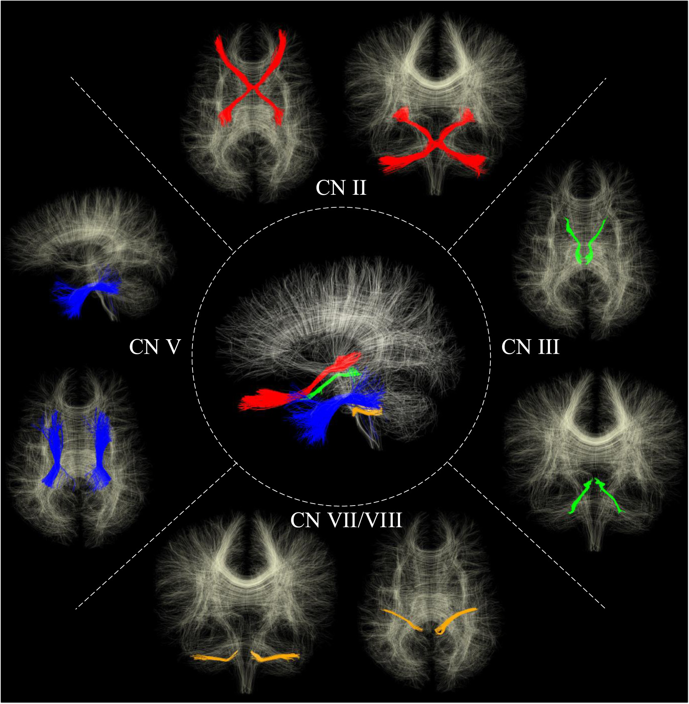
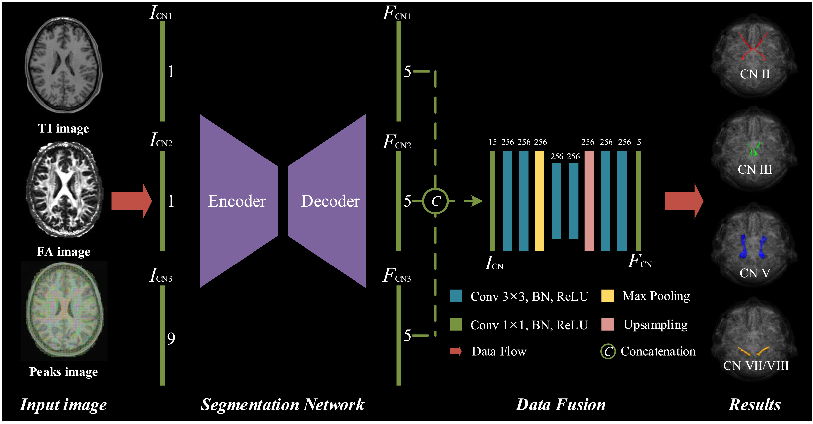
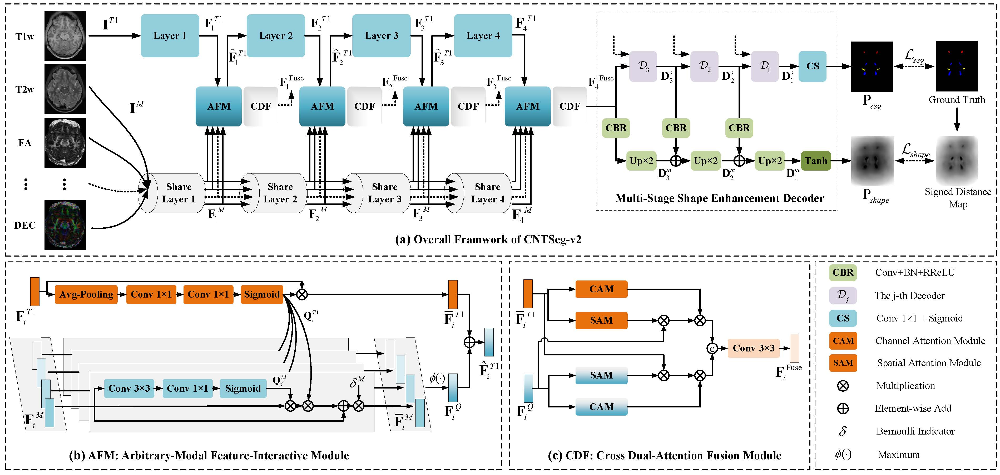
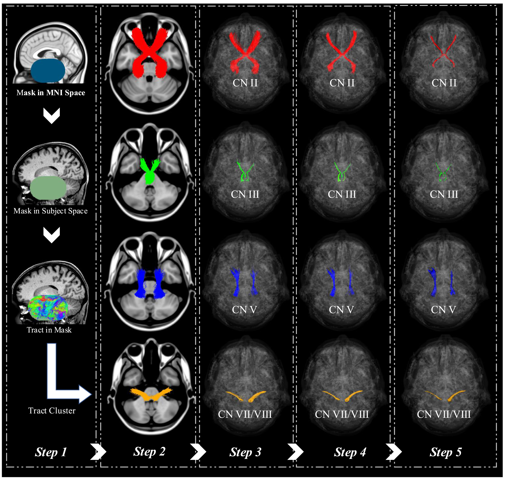

# README

# **Cranial Nerves Tract Segmentation -- CNTSeg**

---

Due to the slender structure of cranial nerves (CNs) and the complex anatomical environment, single-modality data based on dMRI cannot provide a complete and accurate description. CNs tract segmentation is the strategy of voxel-wise analysis, which directly classifies voxels based on associated fiber bundles, bypassing traditional streamline analysis. CNTSeg has achieved the segmentation of 5 pairs of CNs (i.e. optic nerve *CN II*, oculomotor nerve *CN III*, trigeminal nerve *CN V*, and facial–vestibulocochlear nerve *CN VII/VIII*).

<div align=center>

</div>

CNTSeg is the code for the following papers. Please cite the papers if you use it.

- Xie L, Huang J, Yu J, et al. Cntseg: A multimodal deep-learning-based network for cranial nerves tract segmentation[J]. Medical Image Analysis, 2023, 86: 102766.
- CNTSeg-v2: An Arbitrary-Modal Fusion Network for Cranial Nerves Tract Segmentation. Submitted to Medical Image Analysis.

  

# **Install**

---
- pytorch >= 2.0.1
- Torchvision >= 0.15.2
- python >= 3.6
- numpy >= 1.20.1
- SimpleITK >= 2.2.1


# **How to use**

---
Note: Use the MRtrix3 to process primary DWI data and get the corresponding FA images, Peaks images, and DEC images; The Human Connectome Project dataset is available at [https://db.humanconnectome.org](https://db.humanconnectome.org/).

- Preprocess

1. Crop the HCP data (i.e., T1w and dMRI data) with a spatial resolutionof 145×174×145 voxels to 128×160×128 voxels; normalize the T1w images, T2w images, and dMRI data from 0 to 255.
```
python Pre_data.py
```
2. Obtaining training and testing data
```
python createmydata.py
```
- For CNTSeg

In this work, we propose a novel multimodal deep-learning-based multi-class network for automated cranial nerves tract segmentation without using tractography, ROI placement or clustering, called CNTSeg. Specifically, we introduced T1w images, fractional anisotropy (FA) images, and fiber orientation distribution function (fODF) peaks into the training data set, and design the back-end fusion module which uses the complementary information of the interphase feature fusion to improve the segmentation performance. 

<div align=center>

</div>

1. Find the best weights for single modalities separately
```
python train_Single.py (train_T1, train_FA, and train_Peaks)
python predict_Single.py (train_T1, train_FA, and train_Peaks)
```
2. Load the best weights of a single modality to train the CNTSeg
```
python train_CNTSeg_V1.py
```
3. Validate model
```
python predict_CNTSeg_V1.py
```


- For CNTSeg-v2

In this work, we propose a novel arbitrary-modal fusion network for CNs tract segmentation, called CNTSeg-v2, which trains one model to handle different combinations of available modalities. Instead of directly combining all the modalities, we select T1-weighted (T1w) images as the primary modality according to simplicity in data acquisition and contribution most to the results, which supervises the information selection of other auxiliary modalities (T2w images, FA images, Peaks images, and DEC images).

<div align=center>

</div>

1. Train the CNTSeg-v2
```
python train_CNTSeg_V2.py
```
2. Validate model
```
python predict_CNTSeg_V2.py
```
3. Validate missingmodality model of CNTSeg-v2 (16 available modalities)
```
python predict_CNTSegV2_Missingmodality.py
```
4. Other: Effectiveness on Components of CNTSeg-v2

```
## AFM, CDF, MSSE, and ALL
python train_CNTSeg_V2_without_AFM.py; train_CNTSeg_V2_without_CDF.py; train_CNTSeg_V2_without_MSSE.py; train_CNTSeg_V2_without_ALL.py
python predict_CNTSeg_V2_without_AFM.py; predict_CNTSeg_V2_without_CDF.py; predict_CNTSeg_V2_without_MSSE.py; predict_CNTSeg_V2_without_ALL.py
```

5. Other: Train and Validate other models
```
python train_MMFNet.py
python predict_MMFNet.py
```
# **reference data**

Regarding the reference data and the pre-trained models, we are not sharing it for the time being due to some cooperative unit agreements and future layouts. For reference data acquisition, you can use the steps described in Section 2.4 of our paper (Medical Image Analysis, 2023) to do so, which I think is an important step. 

<div align=center>

</div>


# **Concact**

---
Lei Xie, College of Information Engineering, Zhejiang University of Technology

leix@zjut.edu.cn
