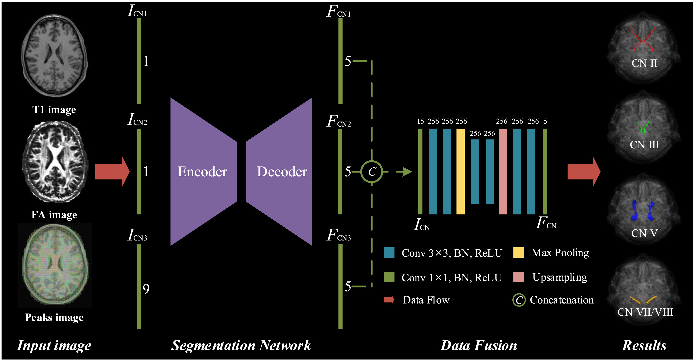

# README

# **CNTSeg: A multimodal deep-learning-based network for cranial nerves tract segmentation**

---

by Lei Xie, Jiahao Huang, Jiangli Yu, Qingrun Zeng, Qiming Hu, Zan Chen , Guoqiang Xie , Yuanjing Feng

- College of Information Engineering, Zhejiang University of Technology
- Nuclear Industry 215 Hospital of Shaanxi Province

# **Introduction**

---

In this work, we propose a novel multimodal deep-learning-based multi-class network for automated cranial nerves tract segmentation without using tractography, ROI placement or clustering, called CNTSeg. Specifically, we introduced T1w images, fractional anisotropy (FA) images, and fiber orientation distribution function (fODF) peaks into the training data set, and design the back-end fusion module which uses the complementary information of the interphase feature fusion to improve the segmentation performance. CNTSeg has achieved the segmentation of 5 pairs of CNs (i.e. optic nerve *CN II*, oculomotor nerve *CN III*, trigeminal nerve *CN V*, and facial–vestibulocochlear nerve *CN VII/VIII*).



# **Citation**

---

```bash
@article{XIE2023102766,
title = {CNTSeg: A multimodal deep-learning-based network for cranial nerves tract segmentation},
journal = {Medical Image Analysis},
pages = {102766},
year = {2023},
issn = {1361-8415},
doi = {https://doi.org/10.1016/j.media.2023.102766},
url = {https://www.sciencedirect.com/science/article/pii/S1361841523000270},
author = {Lei Xie and Jiahao Huang and Jiangli Yu and Qingrun Zeng and Qiming Hu and Zan Chen and Guoqiang Xie and Yuanjing Feng},
keywords = {Cranial nerves tract, Segmentation, Multimodal, Deep learning},
abstract = {The segmentation of cranial nerves (CNs) tracts based on diffusion magnetic resonance imaging (dMRI) provides a valuable quantitative tool for the analysis of the morphology and course of individual CNs. Tractography-based approaches can describe and analyze the anatomical area of CNs by selecting the reference streamlines in combination with ROIs-based (regions-of-interests) or clustering-based. However, due to the slender structure of CNs and the complex anatomical environment, single-modality data based on dMRI cannot provide a complete and accurate description, resulting in low accuracy or even failure of current algorithms in performing individualized CNs segmentation. In this work, we propose a novel multimodal deep-learning-based multi-class network for automated cranial nerves tract segmentation without using tractography, ROI placement or clustering, called CNTSeg. Specifically, we introduced T1w images, fractional anisotropy (FA) images, and fiber orientation distribution function (fODF) peaks into the training data set, and design the back-end fusion module which uses the complementary information of the interphase feature fusion to improve the segmentation performance. CNTSeg has achieved the segmentation of 5 pairs of CNs (i.e. optic nerve CN II, oculomotor nerve CN III, trigeminal nerve CN V, and facial–vestibulocochlear nerve CN VII/VIII). Extensive comparisons and ablation experiments show promising results and are anatomically convincing even for difficult tracts. The code will be openly available at https://github.com/IPIS-XieLei/CNTSeg.}
}
```

# Train

---

Enter python train_mutil_T1_FA_Peaks.py to run the code. If you are prompted for no packages, enter pip install * * to install dependent packages

# Test

---

After training, you can use the python predict_mutil_T1_FA_Peaks.py to validate your model.

# Concact

---

Lei Xie, leix@zjut.edu.cn
